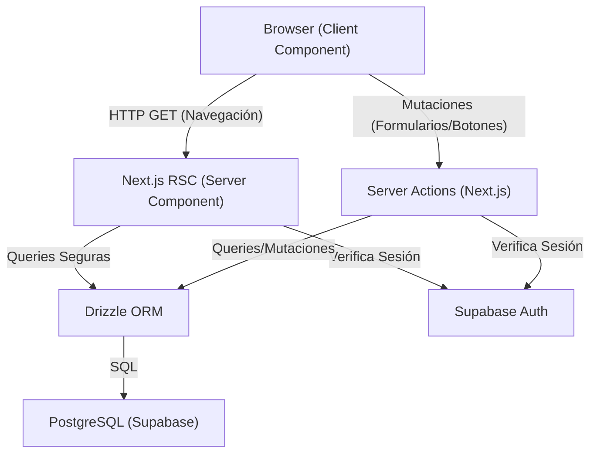
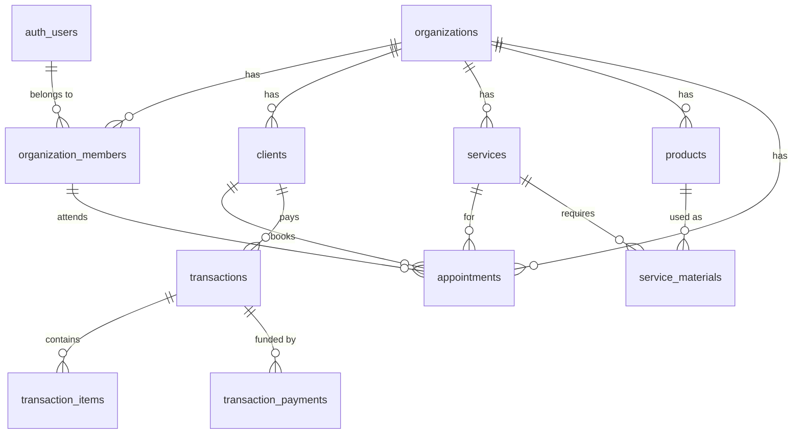
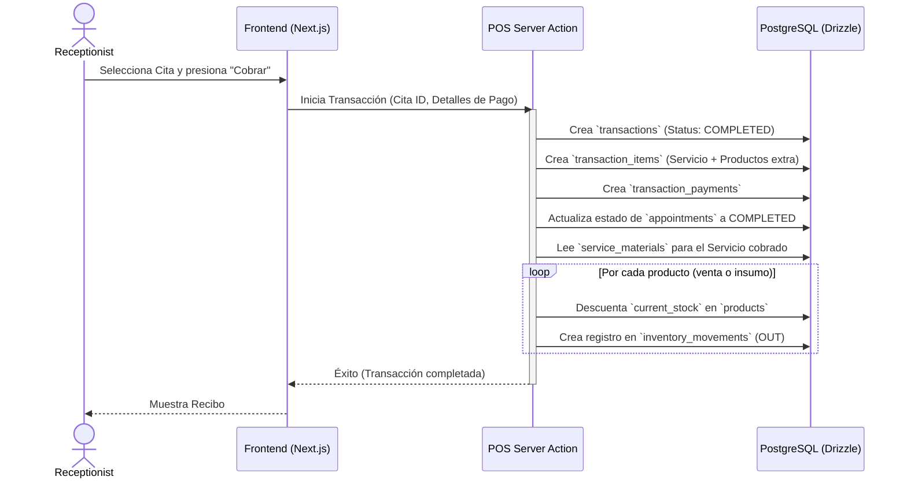

# Arquitectura del Sistema

La arquitectura de Trimora está diseñada sobre tecnologías modernas del ecosistema de React, priorizando el rendimiento, la escalabilidad en un entorno Multi-tenant y una experiencia de desarrollo (DX) excepcional.

## Stack Tecnológico

*   **Frontend & Meta-Framework:** Next.js (v15+) utilizando App Router, React 19 y Server Actions para las mutaciones de datos.
*   **Estilos y UI:** Tailwind CSS v4 para diseño atómico y componentes de interfaz construidos desde cero.
*   **Base de Datos y Backend:** Supabase (PostgreSQL) utilizado como capa de base de datos relacional y gestor de identidad (Auth).
*   **Capa de Acceso a Datos (ORM):** Drizzle ORM para consultas fuertemente tipadas y migraciones.
*   **Inteligencia Artificial:** Vercel AI SDK integrado para funcionalidades de asistentes inteligentes.

## Diagrama de Arquitectura de Alto Nivel

El siguiente diagrama muestra cómo interactúan las capas del sistema desde el cliente hasta la base de datos.

## Diagrama de Entidad Relación (ERD) Core

Este diagrama representa el núcleo de la base de datos, mostrando la estructura Multi-tenant (todo cuelga de la tabla `organizations`).

## Flujo de Trabajo: Cita a POS a Inventario

Una de las premisas de valor más fuertes de Trimora es la automatización. A continuación, se muestra el diagrama de secuencia para el flujo de completar una cita.

## Seguridad y Tenencia Múltiple (Multi-tenant)

La seguridad se maneja en dos niveles críticos:
1.  **Supabase Auth:** Garantiza que el usuario tenga un token JWT válido (manejado vía SSR/Cookies con `@supabase/ssr`).
2.  **Filtrado por `organization_id`:** En el código (a través de utilidades en `src/core/database/admin.ts` y en Drizzle), cada consulta de lectura y mutación asegura incluir cláusulas `where(eq(table.organizationId, orgId))` para evitar la filtración de datos cruzados entre clientes del SaaS.
